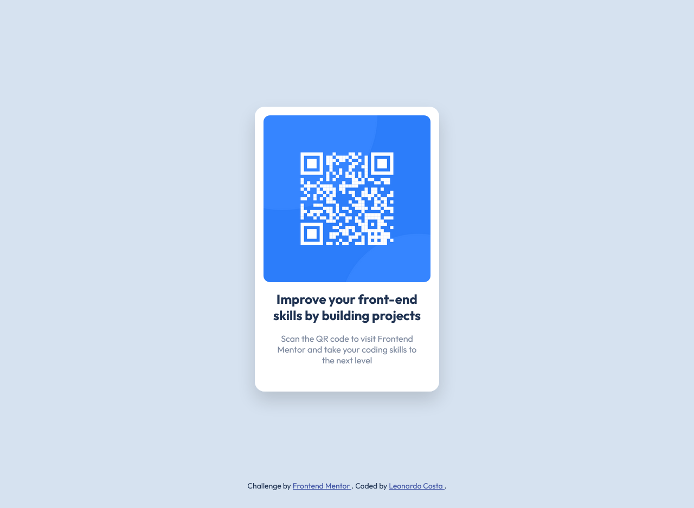

# Frontend Mentor - QR Code Component solution

This is a solution to the [QR Code Component challenge on Frontend Mentor](https://www.frontendmentor.io/challenges/qr-code-component-iux_sIO_H). Frontend Mentor challenges help you improve your coding skills by building realistic projects.

## Table of contents

- [Frontend Mentor - QR Code Component solution](#frontend-mentor---qr-code-component-solution)
  - [Table of contents](#table-of-contents)
  - [Overview](#overview)
    - [Screenshot](#screenshot)
    - [Links](#links)
  - [My process](#my-process)
    - [Built with](#built-with)
  - [Author](#author)

## Overview

### Screenshot

### Links

- [Solution](https://www.frontendmentor.io/solutions/qr-code-component-using-html-and-css-NwDwI8-03)
- [Live Site](https://leocosta1.github.io/frontend-mentor-challenges/challenges/qr-code-component-main/)

## My process

### Built with

- Semantic HTML5 Markup
- CSS Custom Properties
- CSS BEM Methodology
- CSS Flexbox
- Mobile-First Workflow

## Author

- GitHub - [Leonardo Costa](https://github.com/leocosta1)
- Frontend Mentor - [@leocosta1](https://www.frontendmentor.io/profile/leocosta1)
